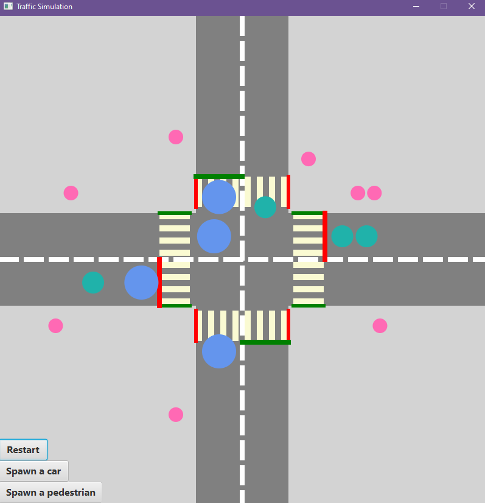
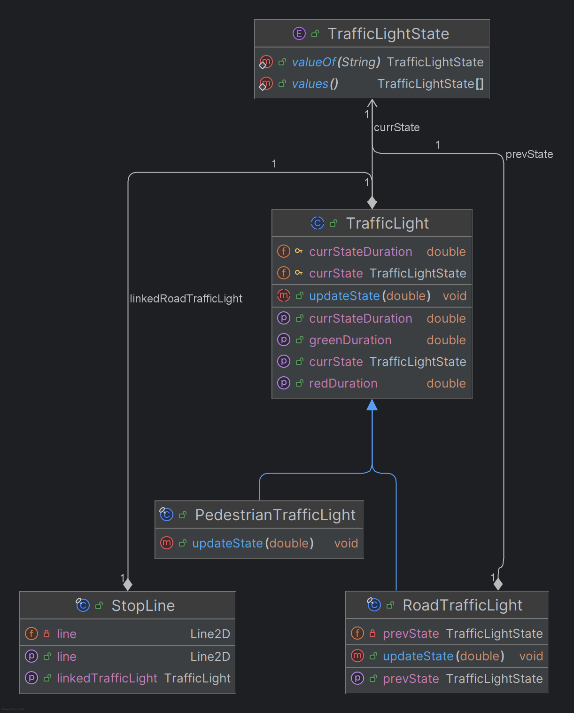
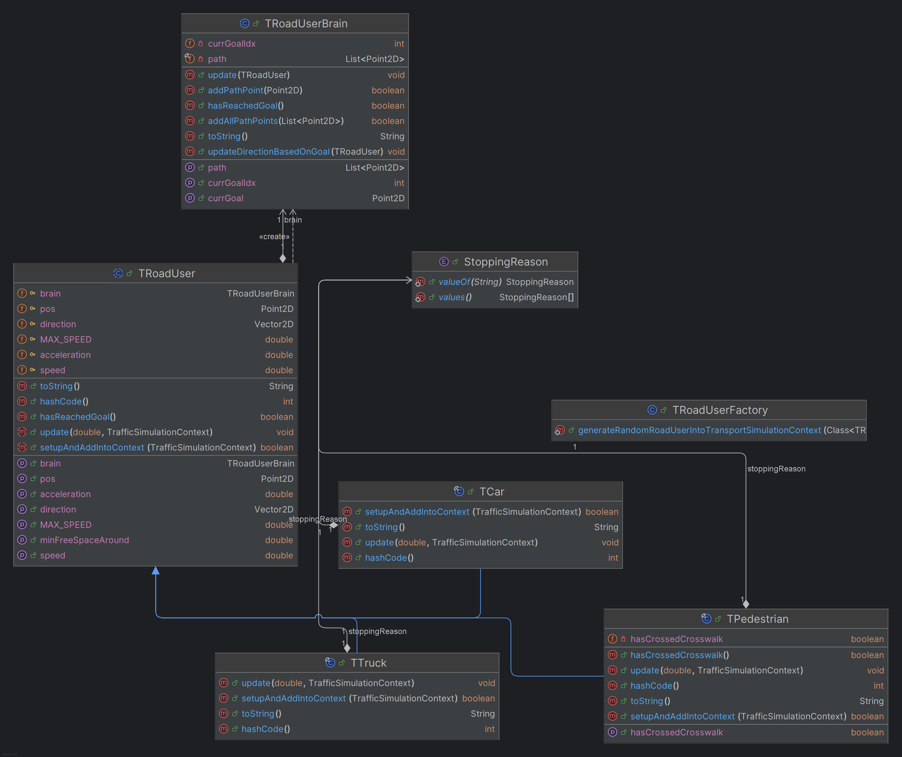

# Traffic Simulator

## Имя проекта
Traffic Simulator

---

## Описание
Traffic Simulator – учебный программный проект для моделирования дорожного движения на перекрёстке.

Цель проекта – наглядно показать, как можно описывать и управлять взаимодействием различных участников дорожного движения (транспорт и пешеходы) с учётом инфраструктуры перекрёстка: светофоров, стоп-линий и заранее заданных маршрутов.

Проект решает следующие задачи:
- демонстрирует применение объектно-ориентированного проектирования на примере сложной предметной области;
- позволяет моделировать пошаговое изменение состояния системы во времени;
- разделяет физическую модель движения, навигационную логику, конфигурацию сценария и визуализацию.

Данное программное обеспечение может быть полезно студентам и начинающим разработчикам для изучения ООП, архитектурных подходов и принципов разделения ответственности в программных системах.

---

## Технологический стек
- Язык программирования: **Java**
- Графический интерфейс и визуализация: **JavaFX**
- Среда разработки: **IntelliJ IDEA**

Приложение является самостоятельным настольным Java-приложением и не требует интеграции с внешними фреймворками или сервисами.

---

## Статус
Проект находится в стадии **Alpha**.

Реализована базовая логика симуляции и визуализация перекрёстка. Архитектура допускает расширение функциональности и усложнение сценариев.

---

## Ссылка на продукт или демо-экземпляр
Демо-версия в виде исполняемого файла отсутствует.

Проект предназначен для сборки и запуска из исходного кода.

---

## Отличия от аналогичных проектов
В отличие от полноценных транспортных симуляторов, данный проект:
- ориентирован на учебные цели, а не на физически точную модель;
- имеет простую и расширяемую архитектуру;
- подчёркивает разделение логики движения, навигации, конфигурации и визуализации;
- легко адаптируется под новые сценарии перекрёстков без изменения ядра симуляции.

---

## Скриншот рабочего окна приложения

---

## Архитектура
Проект разделён на логические пакеты, каждый из которых отвечает за отдельную часть системы.

### Общая схема

Диаграмма классов из пакета RoadEquipment

Диаграмма классов из пакета RoadUsers

Диаграмма классов из пакета Simulation

### Назначение пакетов

- **road_users** – участники дорожного движения:
  - абстрактный базовый класс `TRoadUser`;
  - реализации: `TCar`, `TTruck`, `TPedestrian`;
  - навигационная логика (`TRoadUserBrain`);
  - перечисление причин остановки (`StoppingReason`).

- **road_equipment** – элементы дорожной инфраструктуры:
  - светофоры (`TrafficLight`, `RoadTrafficLight`, `PedestrianTrafficLight`);
  - стоп-линии (`StopLine`).

- **geometry / math** – геометрические и математические примитивы:
  - `Point2D`, `Vector2D`, `Line2D`;
  - вспомогательные вычисления (`Math`).

- **simulation** – ядро симуляции:
  - `TrafficSimulation`;
  - `TrafficSimulationContext`.

- **graphics** – визуализация:
  - `TrafficSimulationGraphics`;
  - `TrafficSimulationGraphicsImpl`.

- **config** – конфигурация сценариев:
  - `TrafficSimulationConfiguration`;
  - `TrafficSimulationConfigurationImpl`.

---

## Зависимости
Для работы проекта необходимы:
- Java Development Kit (JDK) **21** или выше;
- JavaFX (совместимая версия с используемым JDK);
- IntelliJ IDEA (рекомендуется, но не обязательно).

В проекте не используются сторонние библиотеки, кроме JavaFX.

---

## Установка
1. Установить JDK версии 21  или выше.
2. Установить JavaFX (если он не включён в используемую сборку JDK).
3. Склонировать репозиторий проекта.
4. Открыть проект в IntelliJ IDEA.
5. Убедиться, что JavaFX корректно подключён к проекту.
6. Запустить главный класс приложения.

---

## Конфигурация
Конфигурация симуляции задаётся через реализацию интерфейса:
- `TrafficSimulationConfiguration`.

В конфигурации определяются:
- светофоры и их режимы;
- стоп-линии;
- маршруты движения участников;
- начальные параметры симуляции.

Для изменения сценария перекрёстка достаточно изменить или создать новую реализацию конфигурации.

---

## Применение
После запуска приложения:
1. Инициализируется сценарий перекрёстка.
2. Симуляция обновляется пошагово во времени.
3. На экране отображается текущее состояние участников движения и инфраструктуры.

Симуляция предназначена для визуального анализа поведения объектов и отладки логики движения.

---

## Проверка ПО
Автоматизированные тесты в проекте отсутствуют.

Проверка корректности работы осуществляется визуально при запуске симуляции.

---

## Проблемы
Известные ограничения проекта:
- упрощённая физическая модель движения;
- отсутствие столкновений и аварийных ситуаций;
- отсутствие автоматизированных тестов;
- минималистичный пользовательский интерфейс.

---

## Получение справочной информации
Для получения помощи можно:
- изучить исходный код проекта;
- обратиться к документации классов;
- создать issue в системе отслеживания проблем данного репозитория.

---

## Другое
Если у вас есть вопросы, проблемы или отчёты об ошибках, используйте систему отслеживания проблем репозитория.

---

## Приглашение к сотрудничеству
Возможные направления развития проекта:
- усложнение логики поведения участников дорожного движения;
- добавление новых типов перекрёстков;
- реализация столкновений и конфликтных ситуаций;
- улучшение визуализации и интерфейса;
- добавление автоматизированных тестов.

---

## Open source licensing info

### TERMS
Использование, копирование, модификация и распространение программного обеспечения разрешены в соответствии с условиями лицензии MIT.

### LICENSE
Проект распространяется под лицензией **MIT License**. Подробные условия см. в файле `LICENSE`, расположенном в корне репозитория.

### CFPB Source Code Policy
Не применяется.

---

## Источники и справочники
- Учебные материалы по объектно-ориентированному проектированию
- Документация Java
- Документация JavaFX

---

## Проекты, которые вдохновили
- Учебные симуляторы дорожного движения
- Примеры архитектурных учебных проектов
- Traffic simulation examples (SUMO, SimPy)
- Учебные проекты по моделированию систем

---

## Связанные проекты
- SUMO (Simulation of Urban Mobility)
- OpenTrafficSim

---

## Книги, статьи и другие источники
- Книги и статьи по ООП и архитектуре ПО
- Материалы по моделированию дискретных систем
- [Практикум "Паттерны конструирования"](https://sites.google.com/view/study-pattern/%D0%B3%D0%BB%D0%B0%D0%B2%D0%BD%D0%B0%D1%8F/)

---

## Автор
Ирхин Илья
